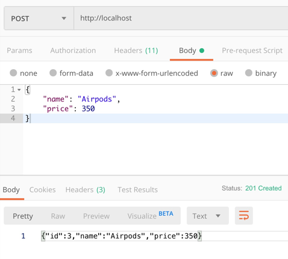
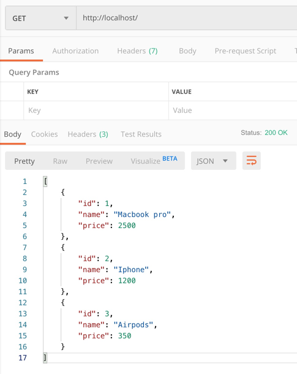

# Go Microservice deploy using docker

## Build and deployment
```shell script
docker build -t deiveehan/gosvc:1.1 .
docker images
docker run -p 80:80 deiveehan/gosvc:1.1

brew install httpie
http localhost
cat test/newproduct.json | http POST localhost
http localhost

# Building with a simpler docker image - reducing file size
docker build --file Dockerfile-2 .

```

## Testing using POSTman

POST



GET
